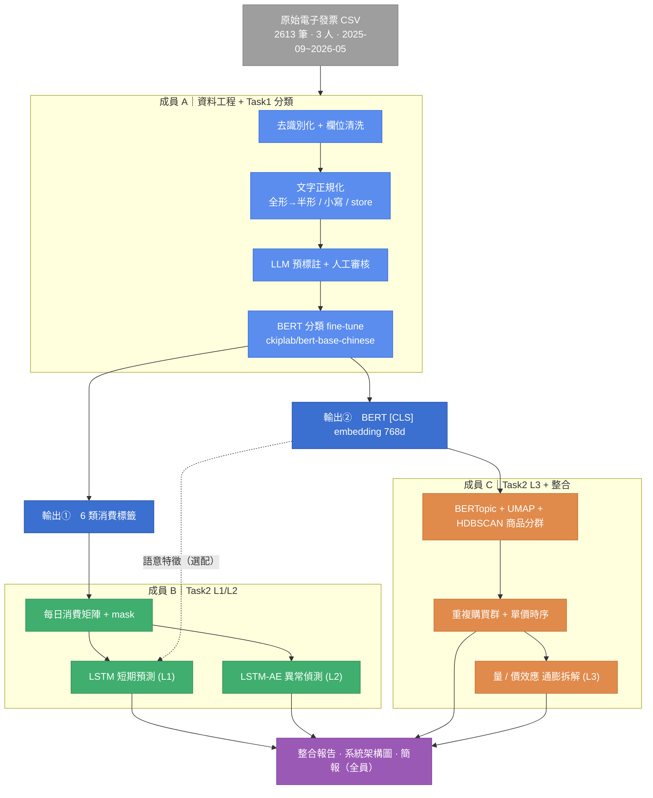

# 系統架構

投影片用圖：`outputs/system_architecture.png`（由 `make_architecture.py` 生成，可改座標/文字後重跑）。
下方為可編輯的 Mermaid 版（GitHub、VS Code、draw.io、Typora 等可直接渲染）。

## 重點說明（口頭報告用）

- **資料流主軸**：CSV →（A）清洗/標註/BERT 分類 → 產出**標籤**與**embedding** →
  （B）標籤彙整成每日矩陣做預測/異常 ＋（C）embedding 做商品分群與通膨拆解 → 全員整合。
- **成員 C 的關鍵接點**：直接複用 A 的 `receipt_embeddings.npy`，**不重跑 BERT**。
- **跨模組亮點**：embedding 也可作為 B 的 LSTM「語意輔助特徵」（虛線、選配），體現
  Task1 中間層向量被下游重用的設計（企劃書第二章核心設計）。
