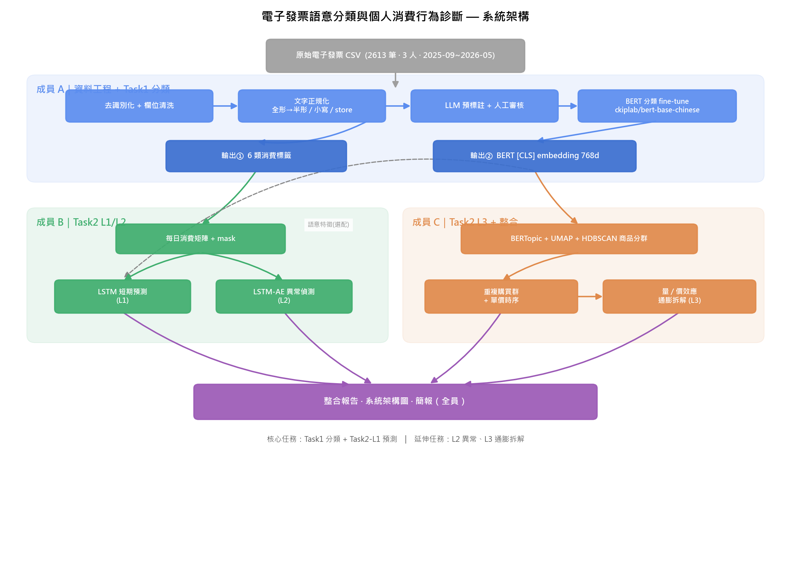
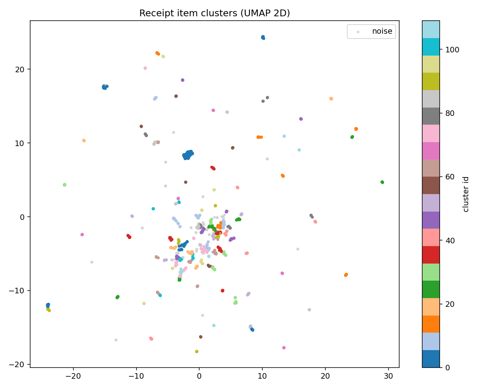
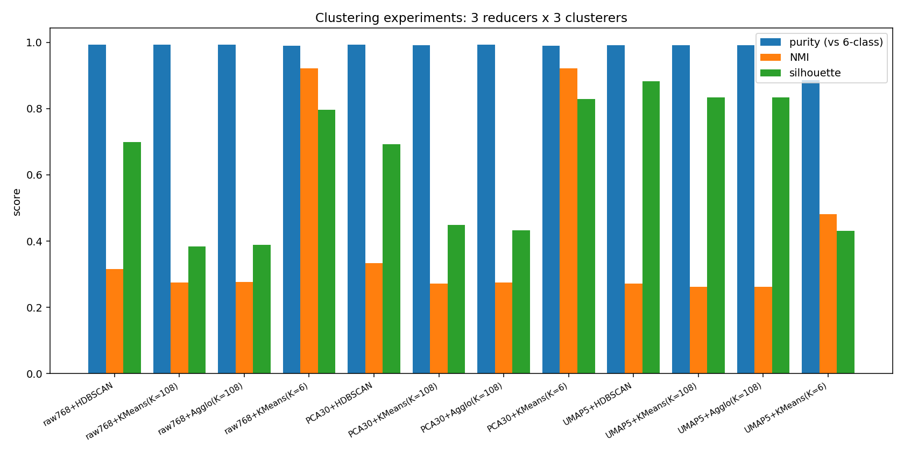
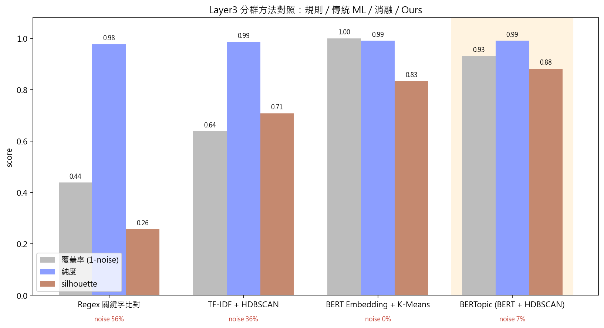
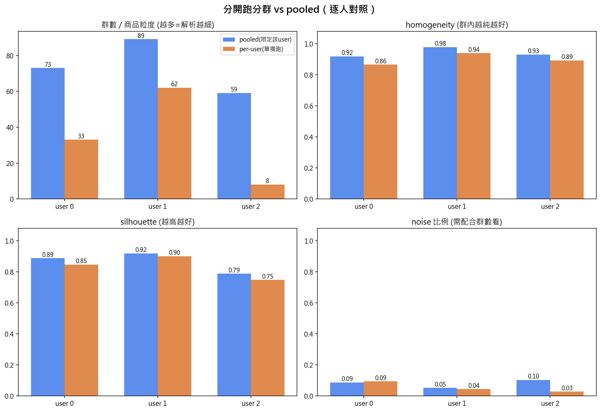
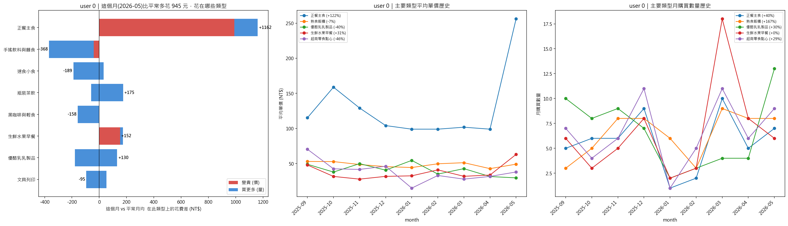
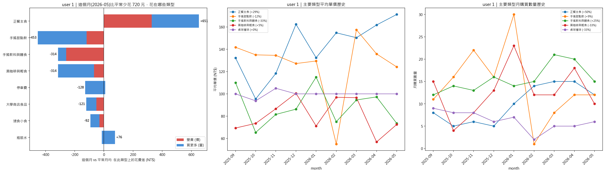
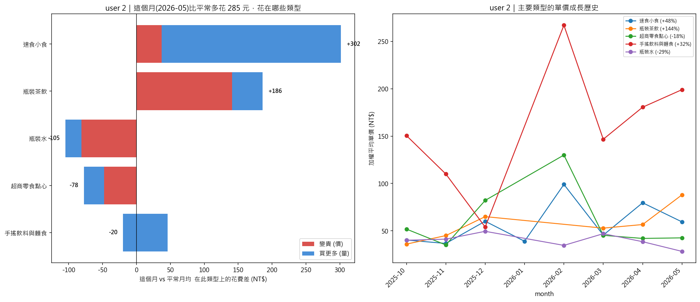
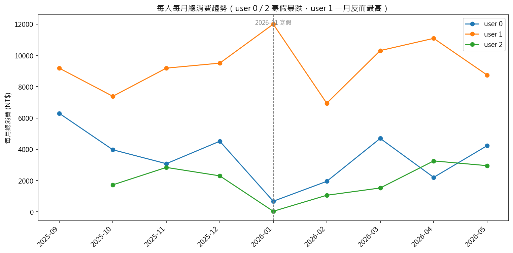
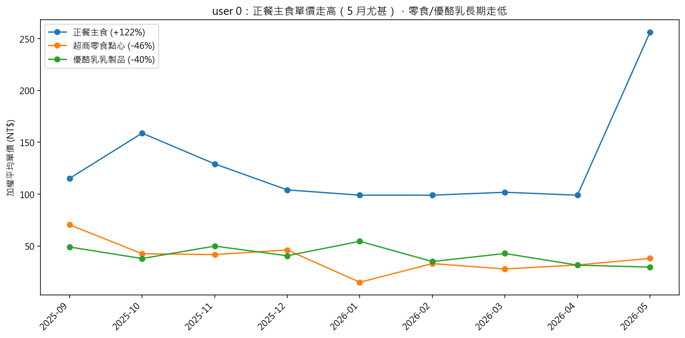

# 電子發票消費行為診斷
## Task 2 Layer 3：商品語意分群與個人消費增量分析（成員 C）

> **一句話**：把成員 A 的發票分類結果，用 BERT 語意把「品項」聚成「商品類型」，再追蹤每個
> 類型沿時間的單價與數量變化，回答——**這個月比平常多花的錢，花在哪些類型、是「變貴」還是「買更多」。**

---

## 摘要（核心發現）

1. **商品語意分群成功**：~110 個商品類型群，noise 僅 6.9%、純度 0.99，每群是語意一致的商品
   （如「美式咖啡群」含中/大/特大冰美式；「牛肉麵店群」含清燉/紅燒/三寶）。
2. **個人通膨是「品項分化」的，不是齊漲**：user 1 的清燉牛肉 **+11%**、沙拉飯 **+9%**，
   但原味波士頓 **−6%**、紅茶持平。「東西越來越貴」不普遍成立。
3. **多花的錢主要來自「買更多」而非「變貴」**：user 1 本月在清燉牛肉類多花 **1003 元**，
   其中買更多 860、變貴僅 143（平常每月 2.25 份 → 本月 6 份）。
4. **方法經完整驗證**：分群方法、baseline、pooled vs 分開、顆粒度都有對照實驗支撐。

---

## 1. 資料與系統定位

| 項目 | 內容 |
|---|---|
| 輸入（成員 A） | 2613 筆發票明細、3 位使用者、2025-09～2026-05、6 類消費標籤 |
| | `receipt_embeddings.npy`：2613×768 BERT `[CLS]` 向量（逐列對齊，直接複用不重訓） |
| 資料分布 | 飲食 82%、交通 6%、購物 5%、娛樂 3%、教育 3%、醫療 1% |
| 我的任務 | 商品語意分群 → 重複購買/單價追蹤 → 個人增量分析 |



*圖 1：系統架構。成員 A 清洗+分類 → 成員 B 時序預測+異常 → 成員 C（本報告）商品分群+通膨拆解。*

---

## 2. 商品語意分群

### 2.1 方法
`BERT embedding → UMAP(5維, cosine) → HDBSCAN(min_cluster_size=10)`，BERTopic 為框架。
不需預設群數；密度太低的稀有品項自動標為 noise。

### 2.2 分群結果：每個群裡有什麼

分出 **110 群**，其中 93 群通過「單價一致性」（可用於通膨分析）、13 群為單品群。
下表是幾個代表性的群（完整清單見 `outputs/step3c_cluster_members.csv`）：

下表為幾個代表性細群（完整 25 超類型的品項對照見 `outputs/supertype_K25_members.csv`）：

| 細群（精準層） | 主要成員 | 所屬超類型（K=25） |
|---|---|---|
| 大冰美式 等3款 | 大冰美式:35 / 特大冰美式:2 / 中冰美式:2 | **美式咖啡** |
| 嫩切雞肉堡 等7款 | 嫩切雞肉堡:42 / 厚切嫩牛堡:3 / 鮮嫩雞柳堡:2 | **正餐主食** |
| 皮蛋乾麵 等15款 | 皮蛋乾麵:10 / 燙青菜:5 / 蛤蠣湯:4 | **手搖飲料與麵食** |
| 四季春珍波椰 等5款 | 大1四季春珍波椰:26 / 大四季春青茶:2 | **手搖飲料與麵食** |
| 御料小館炸雞球 等3款 | 香辣炸雞球:34 / 椒鹽鹽酥雞:1 | **熟食飯糰** |
| 母傳清燉牛肉 等6款 | 清燉牛肉 / 紅燒牛肉 / 紅燒三寶 / 叉燒 / 麻辣牛肉 | **正餐主食** |

> 注意 t0「代收/購物袋」群混了 112 種雜物（單價 3～3099），一致性不通過 → 被通膨分析自動排除。



*圖 2：embedding 降到 2D 的分群散佈圖，群在空間上分得很開（noise 以灰色 × 表示）。*

### 2.3 為什麼選 UMAP + HDBSCAN（方法對照）

非監督任務以 6 類標籤當外部基準，比較 3 降維 × 3 分群（指標算法見 `EXPERIMENTS.md`）：

| 組合 | noise | silhouette | 說明 |
|---|---:|---:|---|
| raw768 + HDBSCAN | 32% | 0.70 | 高維密度估計失準 |
| PCA30 + HDBSCAN | 34% | 0.69 | 同上 |
| **UMAP5 + HDBSCAN（採用）** | **7%** | **0.88** | UMAP 把 noise 砍 ~5 倍、品質最高 |



*圖 3：12 組分群方法對照。BERT emb 直接 KMeans(K=6) 可還原 6 類消費（ARI 0.97），證明 embedding 品質高。*

### 2.4 與 Baseline 對照（驗證 BERTopic 的必要性）

| 方法 | 覆蓋率 | noise | silhouette |
|---|---:|---:|---:|
| Regex 關鍵字（規則下限） | 0.44 | 56% | 0.26 |
| TF-IDF + HDBSCAN（傳統 ML） | 0.64 | 36% | 0.71 |
| BERT + K-Means（消融） | 1.00 | 0% | 0.83 |
| **BERTopic（Ours）** | **0.93** | **7%** | **0.88** |



*圖 4：Ours 同時解決「語意辨識不清」（覆蓋率 44%→93%）與「雜訊干擾」（noise 36%→7%）。
BERT+KMeans 的 0% noise 是假象——強迫每點進群、無離群機制。*

---

## 3. 分群設計與顆粒度

### 3.1 為何三人一起分群（pooled）
分群＝建一本**公共商品字典**（商品身份與「誰買」無關），故三人 pooled；個人診斷才分人。
實測「三人分開分群」對小資料量 user 2 崩潰（粒度崩塌 59→8 群、失去跨人可比），詳見 `per_user_pipeline/REPORT_per_user.md`。



*圖 5：分開跑時 user 2 群數從 59 崩到 8（粒度崩塌）。*

### 3.2 兩層式商品分類（雙階段分群）

細群（~110）對「多花在哪」太細，故設計**兩階段分群**：先用 HDBSCAN 精細分群並濾雜訊，
再對「細群的中心」做一次輕量分群把群數縮成 K 個大類。

#### 第一層：HDBSCAN（密度分群 + 濾雜訊）
對 2613 筆品項的 embedding（UMAP 5D 空間）做 HDBSCAN，得 ~110 個細群。HDBSCAN 的關鍵優勢：

- **自動標出 noise（−1）**：低密度、語意孤立的品項被標為離群，直接排除。
- **小群自動變 noise**：`min_cluster_size=10` 讓「少於 10 筆的群」自動歸為 noise →
  偶發、買一兩次的品項不會形成不穩定的小群。
- 額外再剔除「單價落差過大的不純細群」（如代收/購物袋混雜群）。

→ 第一層產出**乾淨、語意一致、可追單一商品單價**的細群（精準層）。

#### 第二層：對「細群中心」做 KMeans / Agglomerative（縮群數）
把每個細群所有品項 embedding 取平均 → 一個 768 維**中心向量**；於是 ~108 個細群變成
~108 個點。再對這 108 個點做 **Agglomerative(Ward)**（或 KMeans）合併成 K 個超類型。

第二層用 KMeans/Agglomerative 而非再用 HDBSCAN，有兩個理由：

- **可直接指定 K**：HDBSCAN 不能精準控制群數；要「剛好 25 個大類」就需要能指定 K 的演算法。
- **算力低**：只對 ~108 個中心點分群（非 2613 筆），且第一層已濾掉 noise，第二層計算非常快。

→ 第二層產出**好講故事的大類**（故事層），且「一個細群一票」、不受購買次數灌水。

#### 為什麼不「一開始就直接分 25 群」

| 面向 | 直接分 25 群 | 兩階段（110→25） |
|---|---|---|
| 離群值 | 強迫每筆進群，雜訊污染大類 | 第一層先濾 noise/不純群再合併 |
| 細群會否被拆 | 邊界可亂畫，同款商品可能被拆開 | 細群是原子，只併不拆 → 精準層完整保留 |
| 誰主導 | 品項密度（高頻品項主導） | 細群中心（一個商品一票，不受頻率灌水） |
| 拿到幾層 | 只有 25 群，失去細粒度 | 同時有 110 細群 + 25 超類型，可下鑽 |

#### 顆粒度選擇
K=15/25/35 比較後 **採 K=25**（飲料/咖啡/正餐/拉麵分開、bar 數適中）。完整見 `GRANULARITY_EXPERIMENTS.md`。

→ **最終兩層**：精準層（細群，追單一商品單價）＋ 故事層（超類型 K=25，講大類）。
程式：`step3d_supertypes.py`。

---

## 4. 主結果：個人消費增量分析（超類型 K=25）

### 4.1 方法
每人「這個月」= 最新月（2026-05）；「平常」= 之前所有月的月均。
分析以**超類型（K=25）**為單位——把 ~94 個細群合併成 25 個有意義的大類
（見 §3.2 兩階段分群），每人最多 25 組（本月：user 0 = 11 組、user 1 = 14 組、user 2 = 5 組）。

```
變貴 price_effect = (P1−P0)·Q1      買更多 qty_effect = (Q1−Q0)·P0
ΔS = 變貴 + 買更多 = 這個月 − 平常月均（在此超類型上的花費差）
```

「值得分析」門檻（per-user、每超類型）：**基期≥2月 且（月均數量≥10 或 月均花費≥100）**。

### 4.2 user 0：本月多花 945 元，正餐主食暴增



| 超類型 | 平常單價→本月 | 平常/月→本月 | 增量 | 變貴 | 買更多 |
|---|---|---|---:|---:|---:|
| **正餐主食** | 115→**256** (+123%) | 5.5→7 份 | **+1162** | **+989** | +172 |
| 生鮮水果早餐 | 34→63 (+85%) | 6.6→6 | +152 | **+174** | −21 |
| 瓶裝茶飲 | 72→60 | 1.75→5 | +175 | −59 | +234 |
| 手搖飲料與麵食 | 131→90 | 3.5→1 | −368 | −41 | −327 |

→ user 0 本月**大幅多花在正餐主食**（+1162）：超類型均價從 115 大漲到 256（+123%）且買更多 → 主要是這月吃了高單價正餐（如 12fit 特餐 1199 元、清燉牛肉）取代平常的速食。

### 4.3 user 1：本月少花 720 元，正餐主食增但其他減



| 超類型 | 平常單價→本月 | 平常/月→本月 | 增量 | 變貴 | 買更多 |
|---|---|---|---:|---:|---:|
| **正餐主食** | 144→171 (+19%) | 9.75→12 份 | **+651** | +327 | +324 |
| 手搖甜點飲 | 134→124 | 14.5→12 杯 | −453 | −118 | −335 |
| 手搖飲料與麵食 | 91→74 | 15.6→15 | −315 | −258 | −57 |
| 黑咖啡與輕食 | 79→73 | 13.1→10 | −315 | −67 | −248 |
| 停車費 | 34→35 | 15→11 | −128 | +9 | −137 |

→ 整體少花是因為手搖/咖啡類**大幅少買**；但正餐主食（清燉牛肉等）**變貴且買更多**（+327+324）。

### 4.4 user 2：本月多花 285 元，速食與茶飲漲價



| 超類型 | 平常單價→本月 | 平常/月→本月 | 增量 | 變貴 | 買更多 |
|---|---|---|---:|---:|---:|
| **速食小食** | 56→60 (+6%) | 6.3→**11** | **+302** | +37 | +264 |
| **瓶裝茶飲** | 53→88 (+67%) | 3.1→4 | +186 | **+141** | +45 |
| 瓶裝水 | 42→28 | 6.6→6 | −105 | −81 | −24 |

→ 瓶裝茶飲**大漲 67%**（53→88 元，可能從超商普通飲料換成較貴品牌）；速食小食主要是**買更多**。

---

## 5. 核心發現（彙整）

| 發現 | 證據（超類型層） |
|---|---|
| **① 正餐主食是最大增量來源** | user 0 正餐主食 +1162、user 1 正餐主食 +651（兩人均為最大貢獻超類型） |
| **② 增量由「變貴」與「買更多」共同驅動** | user 0 正餐主食：變貴 +989（均價 115→256）+ 買更多 +172；user 1：變貴 +327 + 買更多 +324 |
| **③ 個人通膨類別分化，非齊漲** | user 1：正餐主食均價 +19%、但手搖甜點 −7%、手搖麵食 −19% |
| **④ 同一超類型內，往更高單價品換購也是「變貴」** | user 0 正餐均價 115→256：不是單品漲價，而是這月選了更貴的品項（如高單價特餐取代便宜漢堡） |
| **⑤ 部分類型是「買更多」而非「變貴」** | user 2 速食小食 6.3→11 份（+74%）、增量 +302 幾乎全來自量 +264 |

---

## 5B. 延伸洞察（跨全時序，非只看本月）

把超類型沿 9 個月的時序攤開，還能看到「單月異常」「長期趨勢」等更有趣的型態。

### ① 寒假效應（季節性）



- **user 0、user 2 在 2026-01 消費暴跌**（user 0 從平常 ~4000 掉到 **680**；user 2 更只剩 **39 元**）
  → 寒假離校、校園消費停擺。
- **user 1 反而 1 月最高（11996）** → 生活型態與另兩人相反（寒假仍高消費）。
- 啟示：發票消費有明顯**校園行事曆季節性**，做時序預測（成員 B）需考慮寒暑假效應。

### ② 消費習慣的長期趨勢（越來越多/少）

| 類型 | user | 變化 | 解讀 |
|---|---|---|---|
| 瓶裝茶飲（量） | user 1 | 8 → **16 杯/月**（翻倍） | 喝瓶裝茶的習慣持續增強 |
| 停車費（次） | user 1 | 22 → **11 次/月**（減半） | 整學期開車/停車越來越少 |
| 速食小食（量） | user 0 | 24 → **3 份/月** | 學期初狂吃速食，之後幾乎戒掉 |

### ③ 單價的長期走勢



- **user 0 的便宜類別長期走低**：超商零食點心 **−46%**、優酪乳乳製品 **−40%**（穩定下降）；
  正餐主食單價則走高（尤以 5 月跳升）。
- **user 2 瓶裝茶飲 +144%**（36→88 元）：長期從超商普通飲料換成較貴品牌的「品質升級」型通膨。

### ④ 單月暴衝（某月某類別花特別多）

| user | 類型 | 月份 | 當月花費 / 平常月均 |
|---|---|---|---|
| user 0 | 速食小食 | 2025-09、10 | **3.3×**（1561 vs 466） |
| user 1 | 運動健身 | 2026-01 | **2.9×**（308 vs 108，期末紓壓？） |
| user 0 | 超市鍋物點心 | 2026-03 | 3.0× |

> 這些「單月暴衝」正是成員 B 異常消費偵測（Layer 2）可捕捉的目標——本層提供了
> 「異常落在哪個商品類型」的可解釋性。

---

## 6. 限制

- **資料偏食**：飲食佔 82%，結論主要適用高頻飲食類。
- **發票覆蓋率**：現金/訂閱/轉帳無發票，範圍限可由發票觀察的消費。
- **低頻品項**：出現 <10 次者無法納入商品群（良性邊界）。
- **使用者異質**：user 2 筆數少（428），個別結論信賴度較低。
- **超類型命名為人工**：25 個超類型由人工檢視成員品項後命名（見 `supertype_names_K25.csv`），
  可重現但帶主觀；未來可用 LLM 自動命名。

---

## 7. 結論

1. 以 BERT + UMAP + HDBSCAN 建立**高品質商品語意分群**（noise 7%、純度 0.99），有完整方法與 baseline 驗證。
2. 設計**兩層商品分類體系**（細群追價 + 超類型講故事），並以實驗否決分開分群。
3. 完成**個人消費增量分析**（超類型 K=25），拆解「變貴 vs 買更多」，揭示個人通膨的**品項分化**特性。
4. 跨全時序的**延伸洞察**：寒假消費暴跌的季節性、習慣的長期成長/衰退（瓶裝茶飲翻倍、速食戒掉）、
   單月暴衝——為成員 B 的時序預測與異常偵測提供可解釋的商品類型線索。

> 細節文件：方法/指標算法 `EXPERIMENTS.md`；顆粒度 `GRANULARITY_EXPERIMENTS.md`；
> per-user 對照 `per_user_pipeline/REPORT_per_user.md`；檔案與數據清單 `README_memberC.md`。
