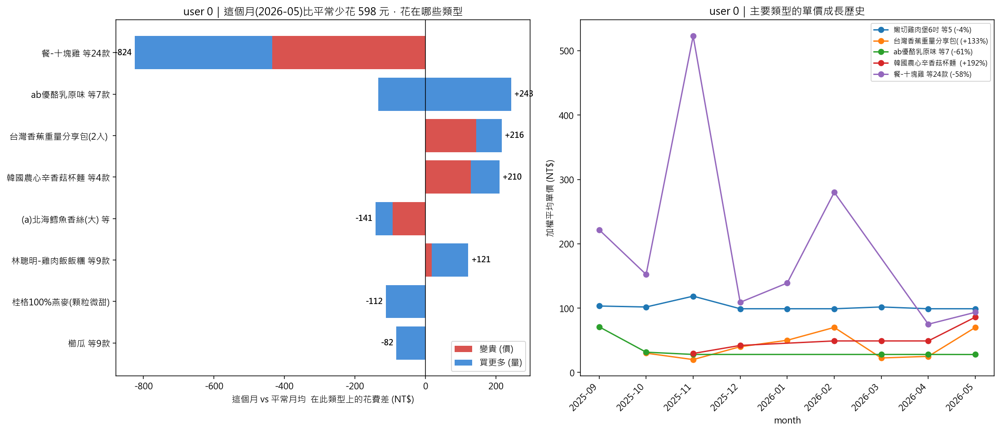
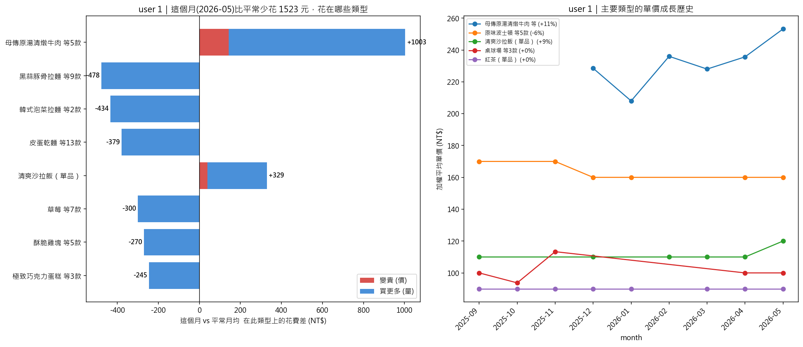
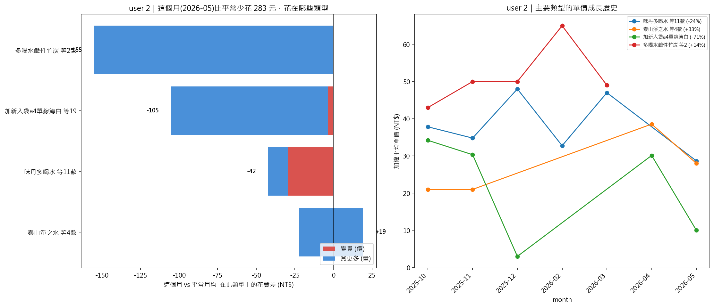

# per-user 對照管線 — 完整分析報告

> 對照實驗：把三人**各自分群**、再**各自做增量分析**，與主流程（pooled 一起分群）對照，
> 檢驗「分開分群」是否可行。結論：**對大資料量使用者可行，對小資料量使用者（user 2）崩潰**。
> 所有產出在 `per_user_pipeline/outputs/`。

---

## 1. 方法

| 步驟 | 程式 | 做法 |
|---|---|---|
| 分開分群 | `pu_step1_clustering.py` | 每人**只用自己的** embedding 跑 UMAP+HDBSCAN（參數同主流程：min_cluster_size=10） |
| 分開增量 | `pu_step3c_increment.py` | 用各自的群當「類型」，重用 step3c 邏輯（清理+一致性+每類型≥10筆）做增量分析 |
| 分群品質對照 | `step1d_per_user_clustering.py` | per-user vs pooled 的 noise/coverage/silhouette/群數 |

---

## 2. 分開分群結果

| user | 筆數 | per-user 群數 | noise |
|---|---:|---:|---:|
| user 0 | 680 | 33 | 9.4% |
| user 1 | 1505 | 62 | 5.0% |
| **user 2** | 428 | **8** | 2.8% |

對照「pooled 限定該 user」的群數：user 0 **73→33**、user 1 **89→62**、user 2 **59→8**。

> 反直覺：user 2 單獨跑 noise 反而下降（10%→3%），但這是**粒度崩塌**的假象——
> 群數從 59 暴跌到 8，把不同商品擠成 8 個粗團塊，homogeneity/silhouette 同步下降。

---

## 3. 分開增量分析結果

| user | 可分析類型數 | 本月多花的錢 | 變貴貢獻 | 買更多貢獻 |
|---|---:|---:|---:|---:|
| user 0 | 25 | −598 | −623 | +25 |
| user 1 | 53 | −1523 | −1 | −1521 |
| **user 2** | **4** | −283 | −55 | −228 |

### user 0（圖：`outputs/pu_step3c_user0.png`）

| 類型 | 平常單價→本月 | 平常/月→本月 | 增量 | 變貴 | 買更多 |
|---|---|---|---:|---:|---:|
| 餐-十塊雞 等24款 | 311→94 | 3.25→2 份 | −824 | −435 | −389 |
| ab優酪乳原味 等7款 | 41→28 | 0.88→10 瓶 | +243 | −134 | +377 |
| 台灣香蕉分享包 等5款 | 34→**70** | 1.88→4 | +216 | **+144** | +72 |
| 韓國農心杯麵 等4款 | 43→**86** | 1.12→3 | +209 | **+129** | +81 |

→ user 0 故事完整：本月狂買優酪乳（10 瓶）、香蕉與杯麵單價翻倍。

### user 1（圖：`outputs/pu_step3c_user1.png`）

| 類型 | 平常單價→本月 | 平常/月→本月 | 增量 | 變貴 | 買更多 |
|---|---|---|---:|---:|---:|
| 母傳原湯清燉牛肉 等5款 | 229→253 | 2.25→6 份 | **+1003** | +143 | +860 |
| 清爽沙拉飯（單品） | 110→120 | 1.38→4 | +329 | +40 | +289 |
| 黑蒜豚骨拉麵 等9款 | — | 2.62→0 | −478 | 0 | −478 |

→ user 1 與主流程結論一致：本月主要多花在清燉牛肉（買更多為主）。

### user 2（圖：`outputs/pu_step3c_user2.png`）★ 問題所在

| 類型 | 平常單價→本月 | 增量 |
|---|---|---:|
| 多喝水鹼性竹炭 等2款 | 48.9→48.9 | −155 |
| 加新入袋 a4 單線簿 等19款 | 13.5→10 | −105 |
| 味丹多喝水 等11款 | 38.4→28.7 | −42 |
| 泰山淨之水 等4款 | 35.4→28 | +19 |

→ **user 2 只剩 4 個可分析類型，且全是瓶裝水/文具**，完全代表不了真實消費。增量分析形同失效。

---

## 4. 與主流程（pooled）對照

| user | pooled 可分析類型(step3c) | per-user 可分析類型 |
|---|---:|---:|
| user 0 | 19 | 25 |
| user 1 | 54 | 53 |
| **user 2** | **8** | **4** |

跨人破碎度：被 ≥2 人購買的商品種類 13 種，pooled 下 100% 落同群（可比），per-user 下 0%（定義上不可能同群）。

---

## 5. 結論：為何主流程不採 per-user

1. **小資料量使用者崩潰**：user 2 可分析類型砍半（8→4），剩的全是瓶裝水/文具。
2. **粒度崩塌**：資料不足 → 細商品群解析不出來 → 退化成 8 個粗團塊。
3. **失去跨人可比**：分開跑無法定義「同一商品」跨人比較。
4. **大資料量者沒有明顯好處**：user 0、1 可分析類型數與 pooled 相當，沒有理由為此犧牲 user 2。

→ **主流程採 pooled 分群（建公共商品字典）+ 分人增量分析（step3c）**。本對照管線作為「試過分開、對小 user 會崩」的實證保留。

---

## 6. 檔案

| 檔案 | 內容 |
|---|---|
| `outputs/pu_clusters.csv` | 三人各自分群結果（每列 `pu_topic`） |
| `outputs/pu_step3c_increment_breakdown.csv` | per-user 增量逐類型明細 |
| `outputs/pu_step3c_user_summary.csv` | per-user 逐人增量摘要 |
| `outputs/pu_step3c_user{0,1,2}.png` | per-user 增量圖 |
| `outputs/exp_per_user_clustering.png` / `.csv` | 分群品質對照 |
| `outputs/exp_per_user_fragmentation.csv` | 跨人破碎度 |
