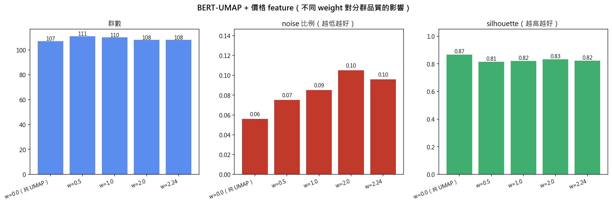

# price-feature 對照管線（BERT-UMAP 後 concat 價格 feature）

> 對照實驗：把 BERT embedding 經 UMAP 降維後，**顯式加上「金額區間」當作額外 feature**
> 再分群，看是否能改善分群品質。獨立資料夾，不與主流程混。

---

## 1. 動機

成員 A 的 BERT 輸入是 `品名 + 店名 + 金額區間` 一起 concat。先前實驗發現
**價格訊號被嚴重稀釋**（embedding 預測金額區間準確率僅 70%，且 75% 細群是「混價群」）。
本實驗測試：**繞過原始 BERT 對金額區間的整合**，先用 UMAP 把 BERT 降到 5D 語意空間，
再單獨把價格區間當成第 6 維 concat 進去，讓價格訊號**不被 768d 的品名/店名稀釋**。

---

## 2. 方法

```
BERT 768d ──UMAP(5D, cosine)──► U                  (5 維語意座標)
                                ├─ StandardScaler ─► U_std (每維 std=1)
price_bucket ──ordinal 0..4 ────► p
                                └─ StandardScaler ─► p_std (std=1)

X = [U_std, w · p_std]   ← w 為價格 feature 的權重
   → HDBSCAN(min_cluster_size=10, min_samples=5)
```

### Weight 設計理由（不是憑空填的）

UMAP 每維 std=1（5 維），p 也 std=1（1 維），故價格 variance 佔總比例 = w² / (5 + w²)：

| w | 價格 var 佔比 | 意義 |
|---|---:|---|
| 0 | 0% | 純 UMAP 基準線 |
| 0.5 | 4.8% | 弱影響 |
| **1.0** | **16.7%** | **預設：與 UMAP 任一維等權** |
| 2.0 | 44.4% | 強影響 |
| √5 ≈ 2.24 | 50% | 價格 = UMAP 5 維總和 |

---

## 3. 結果

| weight | n_clusters | noise | silhouette | purity | NMI |
|---:|---:|---:|---:|---:|---:|
| **0.00（純 UMAP，基準）** | 107 | **5.6%** | **0.867** | 0.989 | 0.268 |
| 0.50 | 111 | 7.5% | 0.814 | 0.992 | 0.268 |
| 1.00 | 110 | 8.5% | 0.820 | 0.992 | 0.260 |
| 2.00 | 108 | 10.5% | 0.832 | 0.989 | 0.255 |
| 2.24 | 108 | 9.6% | 0.822 | 0.986 | 0.254 |



---

## 4. 觀察與結論

1. **noise 隨 weight 上升而增加**（5.6% → 10.5%）：加入價格特徵後，部分品項因「語意相似但
   價格不同」被推到邊緣、判為 noise。價格越重，這個效應越強。

2. **silhouette 全面下降**（0.87 → 0.81~0.83）：純 UMAP 的群在語意空間中最緊湊；加入價格
   feature 後，群被「拉開」到 6 維空間中，群間距相對群內距變化，silhouette 略降。

3. **purity 變化極小**（0.99 ± 0.003）：對 6 類消費標籤的純度幾乎不變，代表加價格不會
   讓商品群「跨類別」。

4. **群數穩定**（107~111）：價格 feature 沒有大幅改變宏觀結構。

→ **以分群指標來看，純 UMAP 仍是最佳組合**。價格 feature 不是「越加越好」。

### 為什麼會這樣？

- BERT embedding **本來就含金額區間訊號**（只是被稀釋），UMAP 降維後該訊號仍部分保留。
- 額外 concat 的價格 feature **與已有訊號重複**，且因離散化（5 bucket）粗糙，反而引入噪音。
- 對「同款不同容量」（大美式 LOW / 特大美式 LOW vs 中冰美式 LOW）影響有限。
- 但對「同名不同價」（如「飲料」既有 35 元手搖也有 200 元餐廳附餐）會把它們**拆開**——
  這是好事但發生機會少，無法抵消整體 noise 上升。

---

## 5. 對後續分析的潛在影響（未跑下游）

本實驗只做分群品質比較，**未跑通膨拆解**。但若採用 w>0 版本，預期：

- ✅ **混價群會少一點**（同類別內單價落差變小）
- ⚠️ **可能拆開「同商品不同容量」**，傷害「相同單品的單價追蹤」
- ⚠️ **「user 0 韓式烤肉 1199 拉高均價」這類洞察會消失**：高單價聚餐會被分到獨立群，
  類型內均價變化變小

→ 對通膨分析來說，純 UMAP 反而更有用。

---

## 6. 與主流程的關係

主流程繼續用純 UMAP+HDBSCAN（`member_c/step1_clustering.py`）。本對照管線：
- 證明「加價格 feature」不是免費的午餐
- 提供「我們有嘗試過 + 為什麼不採用」的實驗證據
- 報告可寫：「BERT embedding 已隱含價格訊號，顯式加入反而引入冗餘並上升 noise」

---

## 7. 重跑

```powershell
cd member_c\price_feature_pipeline
uv run python pf_step1_clustering.py
```

## 8. 檔案

| 檔案 | 內容 |
|---|---|
| `pf_common.py` | path 設定 |
| `pf_step1_clustering.py` | 主實驗腳本 |
| `outputs/pf_clustering_comparison.csv` | 5 個 weight 的指標對照表 |
| `outputs/pf_clustering_comparison.png` | 群數 / noise / silhouette 視覺化 |
